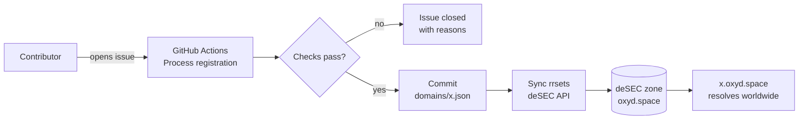

# oxyd.space

Free subdomains for everyone, powered by open source. Point your project at `yourname.oxyd.space` — one issue form, zero dollars, live in minutes.

**Site:** [https://oxyd.space](https://oxyd.space)

## Tools

| Tool | Description |
|------|-------------|
| [DNS Propagation](https://oxyd.space/propagation) | Check DNS resolution across 394+ global resolvers via Supabase edge functions |
| [Availability Checker](https://oxyd.space/checker) | Check if a subdomain is free before registering |
| [Personal Dashboard](https://oxyd.space/dashboard) | Manage your subdomains (GitHub OAuth via Supabase) |
| [Changelog](https://oxyd.space/changelog) | Track every update and improvement |

## How it works



1. Open an issue using the **Subdomain registration** template (register, update or delete).
2. The bot verifies your identity (`github_id` checked against the GitHub API), applies the rules and commits `domains/<name>.json`.
3. DNS records are pushed to **deSEC** immediately — usually resolving worldwide within minutes.

No pull requests, no forks: everything happens through a controlled issue form.

## Registering a subdomain

Fill in the [registration template](https://github.com/YoannDev90/oxyd.space/issues/new?template=register.yml):

| Field                | Description                                                        |
|----------------------|--------------------------------------------------------------------|
| Request type         | Register / Update / Delete                                          |
| Base domain          | The zone your subdomain lives under (see below)                     |
| Subdomain            | Up to 4 levels — `myname`, `service.myname`, `s1.service.myname`    |
| Record type + value  | CNAME (websites), A/AAAA (servers), TXT (verifications)             |
| Additional records   | Optional, one per line: `TYPE VALUE [ttl=3600]`                     |
| Enable www prefix    | Also publishes `www.<subdomain>` with the same records              |

**Note:** Your GitHub user ID is automatically verified via the GitHub API.

The bot generates the config file for you (stored under `domains/<base-domain>/`):

```json
{
  "owner": {
    "github": "your-github-username",
    "github_id": 12345678
  },
  "records": [
    { "type": "CNAME", "value": "your-github-username.github.io" }
  ],
  "www": false
}
```

### Owner fields

| Field       | Required | Description                                         |
|-------------|----------|-----------------------------------------------------|
| `github`    | yes      | Set automatically to the issue author               |
| `github_id` | yes      | Numeric ID, verified against the GitHub API         |
| `www`       | no       | `true` mirrors all records onto `www.<subdomain>`   |
| `records[].ttl` | no   | Integer between 60 and 86400 (default 3600)         |

### Naming rules

- Up to **4 levels**: `s1.service.yourname.oxyd.space`.
- Labels: `a-z`, `0-9`, hyphens; 1–63 chars each.
- Reserved names ([`config/reserved_names.txt`](config/reserved_names.txt)) **cannot end a name**:

| Request                       | Result |
|-------------------------------|--------|
| `nextcloud.oxyd.space`        | reserved top-level name |
| `yoann.nextcloud.oxyd.space`  | cannot end with a reserved word |
| `nextcloud.yoann.oxyd.space`  | personal instance of Nextcloud |
| `s1.nextcloud.yoann.oxyd.space` | deeper nesting is fine |

- Max **10 subdomains per GitHub account**, ownership is tied to the issue author account.
- Updates/deletes are only accepted from the current owner. Transfers are not automated.

### Self-hosting examples

| You run…      | Issue form values                                   |
|---------------|------------------------------------------------------|
| Personal site | CNAME → `you.github.io`, www prefix on               |
| Nextcloud     | `nextcloud.you` → A/AAAA of your server              |
| Second node   | `s2.nextcloud.you` → A/AAAA of the other server      |

### More base domains

`oxyd.space` is the flagship, but other domain owners can plug **their own domains** into this same bot (same rules, same automation — see [MAINTAINER.md](MAINTAINER.md)). Available zones are listed in the issue form's **Base domain** dropdown and in [`config/domains.json`](config/domains.json).

### AI-friendly documentation

For automated registration using `gh` CLI or AI assistants, see [docs/registration.md](docs/registration.md). It includes:
- Step-by-step guides for common use cases
- Ready-to-use `gh issue create` commands
- Naming rules and troubleshooting
- AI assistant instructions for helping users

### CLI tool

A Rust CLI is available for programmatic subdomain management:

```bash
# Build from source (requires Rust)
cd cli && cargo build --release

# Authenticate
./target/release/oxyd login

# Register a subdomain (pre-validates, then opens a GitHub issue)
./target/release/oxyd subdomain create \
  --name myapp.yoann \
  --type CNAME \
  --value yoann.github.io

# List your subdomains
./target/release/oxyd subdomain list

# Delete a subdomain
./target/release/oxyd subdomain delete --name myapp.yoann

# Check DNS propagation
./target/release/oxyd propagation --domain example.com --type A

# JSON output (for Terraform/Ansible integration)
./target/release/oxyd --json subdomain create \
  --name myapp.yoann \
  --type CNAME \
  --value yoann.github.io
```

The CLI pre-validates against the same rules as the bot (via `scripts/validate.py`), then opens a GitHub issue. No server required — it runs locally or in CI/CD.

**CI/CD usage** (GitHub Actions):

```yaml
- name: Register subdomain
  env:
    OXYD_TOKEN: ${{ secrets.OXYD_BOT_PAT }}  # PAT with repo scope
  run: |
    oxyd subdomain create --name app --type CNAME --value app.vercel.app --json
```

The `OXYD_TOKEN` env var is used instead of the device flow in CI. Create a PAT at [github.com/settings/tokens](https://github.com/settings/tokens) with `repo` scope.

### Domain lifetime

`oxyd.space` is registered **one year at a time**. One month before it expires, the project will move to a cheaper successor domain: every registered subdomain is migrated to the new zone automatically, and the old names are kept as permanent redirects — your links keep working, no action required on your side.

---

## Tech stack

- **Frontend:** [Astro](https://astro.build/) — static site, zero JS runtime overhead
- **DNS:** [deSEC](https://desec.io/) — DNS hosting with API
- **Database:** [Supabase](https://supabase.com/) — PostgreSQL + edge functions + GitHub OAuth
- **Edge functions:** [Deno](https://deno.land/) runtime on Supabase — DNS propagation queries via `Deno.resolveDns`
- **CI/CD:** GitHub Actions — automated deploy to `live` branch (GitHub Pages)
- **Health monitoring:** Weekly UDP probes via stdlib Python, auto-eviction of dead resolvers
- **Uptime monitoring:** [BetterStack](https://betterstack.com/) — status page at [status.oxyd.space](https://status.oxyd.space)

## For maintainers

Setup, moderation and operations are documented in [MAINTAINER.md](MAINTAINER.md).

## Releases

| Version | Date | Highlights |
|---------|------|------------|
| [v1.1.0](https://github.com/YoannDev90/oxyd.space/releases/tag/v1.1.0) | 2026-08-29 | DNS Propagation Checker, weekly health monitoring |
| [v1.0.0](https://github.com/YoannDev90/oxyd.space/releases/tag/v1.0.0) | 2026-08-26 | First launch — subdomain registration, tools hub, dashboard |
